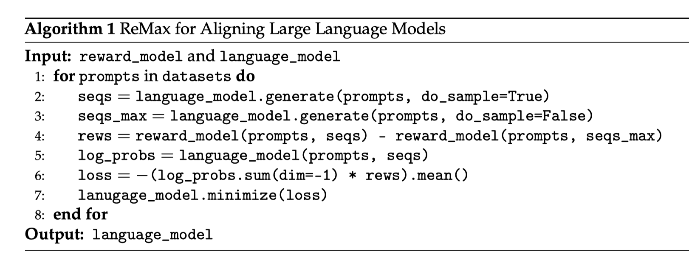

# ReMax: A Simple, Effective, and Efficient Method for Aligning Large Language Models

## Overview

ReMax is a reinforcement learning method, tailored for reward maximization in RLHF.


#### Simple Implementation

ReMax is easy to implement (with **6 lines of code**). We provide an implementation based on the DeepSpeed framework in this resposity. 



#### Memory Efficient

ReMax is memory-efficient. Compared with PPO, ReMax can save about 50% GPU memory consumption, which could be allocated for **1.3x large batch size**.

<details>
<summary>Results of tuning Llama2-7B with A100-80GB GPUs</summary>

| GPUs | Offload | Method | Maximum Batch Size |
| ---- | ------- | ------ | ------------------ |
| 4    | False   | PPO    | ❌ (OOM)            |
| 4    | False   | ReMax  | **4x26=104**       |
| 4    | True    | PPO    | 4x30=120           |
| 4    | True    | ReMax  | **4x40=160**       |
| 1    | True    | PPO    | 1x32=32            |
| 1    | True    | ReMax  | **1x42=42**        |

*: Gradient checkpointing and ZeRO-2 are used for LLM.

*: ZeRO-3 and offload are used for the reward model and the reference model.</details>

</details>

#### Fast Training

ReMax runs fast. It does not need to train a value model and requires fewer computations. Usually, it can achieve about **2x training speed-up**.

<details>
<summary>Results of tuning Llama2-7B with A100-80GB GPUs</summary>

| GPUs | Offload | Method | Total Training Time |
| ---- | ------- | ------ | ------------------- |
| 4    | False   | PPO    | ❌ (OOM)             |
| 4    | False   | ReMax  | **2.4h**            |
| 4    | True    | PPO    | 6.0h                |
| 4    | True    | ReMax  | **2.8h**            |
| 1    | True    | PPO    | 22.0h               |
| 1    | True    | ReMax  | **10.2h**           |

*: Gradient checkpointing and ZeRO-2 are used for LLM.

*: ZeRO-3 and offload are used for the reward model and the reference model.

*: Measurement is based on 45k training samples (with 1 epoch) from the full-hh-rlhf dataset.

</details>

#### Easy to Tune

ReMax is easy to tune for good performance. On the AlpacaEval benchmark, when judeged by GPT-4,  ReMax achieves win rates of 84.22%, 75.28%, and 63.60% over SFT, DPO, and PPO, respectively.


## Change Log

- [2023-12-16] Add response samples of trained models and evaluation results of training speed.
- [2023-10-18] Release the initial code.


## How to use


### Prepare


The Python environment can be set up using Anaconda with the provided `environment.yml` file.

```
conda env create -f environment.yml
conda activate llm
```


### Step 1 SFT

```
cd step1_supervised_finetuning

# OPT(1.3B)
bash training_scripts/opt/run_opt_1.3b.sh

# Llama2(7B)
bash training_scripts/llama2/run_llama2_1.3b.sh
```

### Step 2 Reward Learning

```
cd step2_reward_model_finetuning

# OPT(1.3B)
bash training_scripts/opt/run_opt_1.3b.sh

# Llama2(7B)
bash training_scripts/llama2/run_llama2_1.3b.sh
```

### Step 3 RLHF

```
cd step3_rlhf_finetuning

# OPT(1.3B)
bash training_scripts/opt/run_opt_1.3b.sh

# Llama2(7B)
bash training_scripts/llama2/run_llama2_1.3b.sh
```


## Acknowledgements

Our code is heavily based on the [DeepSpeed-Chat](https://github.com/microsoft/DeepSpeedExamples/tree/master/applications/DeepSpeed-Chat). Please follow the detailed instructions from DeepSpeed-Chat.


## Bibtex

If you find this code is helpful, please cite our paper in the following format.

```
@article{li2023remax,
  title     = {ReMax: A Simple, Effective, and Efficient Method for Aligning Large Language Models},
  author    = {Li, Ziniu and Xu, Tian and Zhang, Yushun and Yu, Yang and Sun, RUoyu and Luo, Zhi-Quan},
  booktitle = {arXiv preprint arXiv:2310.10505},
  year      = {2023},
}
```